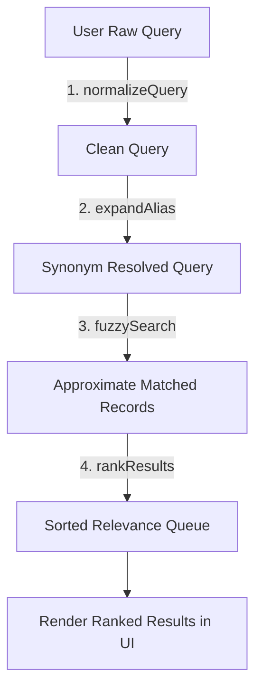

# Build an Interactive Search Engine Laboratory with Next.js
> A Codédex Project Course on Query Pipelines, Fuzzy Matching, and Active Learning

```
    ._________________________.
    | .---------------------. |
    | |      Search...      | |
    | '---------------------' |
    |_________________________|
      \                     /
       \  [o]   [o]   [o]  /  <-- Normalizer, Alias, Fuzzy gates
        \                 /
         \               /
          \_____________/
                 |
                 v
         [Ranked Results]
```


> "The best way to learn is to teach." - Frank Oppenheimer

## 🔗 Quick Links & Repositories
* **Live Demo Website:** [Smart Search Lab Live](https://smart-career-search-lab.vercel.app)
* **GitHub Repository:** [muzafer26/smart-career-search-lab](https://github.com/muzafer26/smart-career-search-lab)
* **Author Profile:** [Codédex Profile (@Muzafer)](https://www.codedex.io/@Muzafer)
* **Report Issues:** [GitHub Issues](https://github.com/muzafer26/smart-career-search-lab/issues)
* **License:** [MIT License](https://github.com/muzafer26/smart-career-search-lab/blob/main/LICENSE)

---

## ⚡ Quick Start (5-Minute Dev Setup)

If you want to immediately spin up the laboratory and explore the completed app before starting the tutorial, follow these steps:

### Prerequisites
* **Node.js:** version `20.x` or higher
* **npm:** version `10.x` or higher
* **Git** installed on your local machine

### Installation
Clone the repository and install all dependencies:
```bash
git clone https://github.com/muzafer26/smart-career-search-lab.git
cd smart-career-search-lab
npm install
```

### Running Commands
* **Start Dev Server:** `npm run dev` (Runs app locally on `http://localhost:3000`)
* **Production Build:** `npm run build` (Compiles static deployment bundle)
* **Lint Check:** `npm run lint` (Runs ESLint static syntax audit)

---

## 🔬 What is Smart Search Laboratory?

Smart Search Laboratory is an interactive educational web platform designed to teach developers how modern search engines process and rank user queries. 

Rather than walking through passive, copy-paste instructions, learners complete four interactive laboratories built directly into the UI:

```
[ Lab 1: Diagnose ] ➔ [ Lab 2: Experiment ] ➔ [ Lab 3: Repair ] ➔ [ Lab 4: Apply ]
```

### The Four Lab Environments:
1. **Explore (Diagnose):** Type messy inputs to witness exact substring matching fail.
   
2. **Understand (Experiment):** Play inside isolated sandbox components to test normalization and fuzzy thresholds.
   
3. **Build (Repair):** Patch buggy query processing functions and watch real-time in-browser unit tests pass or fail.
   
4. **Console (Apply):** Hot-swap databases (Careers, Movies, Books) and toggle pipeline gates to observe search score priority.
   

---

## ✨ Features
* **Interactive Search Console:** Test search behavior dynamically with real-time visual outputs.
* **Diagnose Phase:** Intentionally type messy queries to watch simple string matches fail.
* **Experiment Sandboxes:** Tweak query normalization and edit-distance thresholds side-by-side.
* **Repair Lab (Live Validator):** Fix broken search algorithms and run client-side unit tests live in the browser.
* **Pipeline Status Banner:** Monitor pipeline execution status (`Norm ✓ | Alias ✓ | Fuzzy ✓ | Ranking ✓`) on every keystroke.
* **Dynamic Datasets:** Instantly switch between mock databases of Careers, Movies, Books, Games, and Recipes.
* **Neo-Brutalist UI:** A premium, high-impact aesthetic built using CSS Variables and Tailwind CSS.
* **Confetti Celebration:** Visual particle explosion reward upon successful pipeline assembly.

---

## 🧐 Why This Project Exists?
Most developers treat search engines like a black box—a library they import, plug in, and pray it returns results. 

This project is **not about building a website**. The website is only the teaching medium. The real goal is to demystify query processing pipelines, fuzzy matching algorithms, and search relevance ranking. 

By building an interactive laboratory, you learn to **think like the engineer** who designs search systems for platforms like Spotify, Netflix, Google, and VS Code.

---

## 🎯 What You'll Learn
By the end of this course, you will understand:
* **Query Normalization:** How to standardize messy user queries (stripping spaces, symbols, and casing).
* **Alias Expansion:** How to map synonyms and acronyms (like mapping `ml` to `ai engineer`).
* **Fuzzy Matching:** The mathematics of **Levenshtein Distance** (insertions, deletions, and substitutions).
* **Relevance Ranking:** How to prioritize exact matches and prefix titles over fuzzy matches.
* **State & Performance Optimization:** How to use React's `useMemo` hooks to prevent search lag.
* **Active Learning UX:** How to build interactive educational platforms that teach through exploration.

---

## 📐 Search Pipeline Architecture

Every query entered into the laboratory flows sequentially through the search processing pipeline:



---

## 📐 System Responsibilities

To separate layout concerns from search logic, our codebase strictly segregates duties:

```
[ React Page Component ] (app/page.tsx)
          │
          ▼ calls
[ Search Pipeline Engine ] (lib/search.ts)
          │
          ▼ processes records from
[ Careers Seed Database ] (lib/seed-careers.ts)
```

* **UI Layer (`app/page.tsx`):** Coordinates user interaction, checkbox toggles, input queries, and renders search result templates.
* **Search Core Engine (`lib/search.ts`):** Pure utility module that processes queries (normalization, alias expansion, fuzzy calculations, ranking). Has zero React dependencies.
* **Database Layer (`lib/seed-careers.ts`):** Holds static arrays of records conforming to our document schemas.

---

## 🧭 Course Roadmap

### 📦 Part I: Experiencing Search Failure
* **Chapter 1: The Hook & Setup** (Workspace setup, folder structures, and the Next.js workspace)
* **Chapter 2: Diagnose (Let's Break Search)** (Experiencing exact-match failures, DevTools string challenge)

### ⚙️ Part II: Coding the Search Pipeline
* **Chapter 3: Normalization (Cleaning the Mess)** (Implementing regex query standardizing)
* **Chapter 4: Alias Expansion (Synonyms)** (Synonym dictionaries and keyword routing)
* **Chapter 5: Fuzzy Matching (Levenshtein Distance)** (Fuzzy match thresholding and Fuse.js integration)
* **Chapter 6: Relevance Ranking (Sorting Results)** (Writing sorting comparators for match priority)

### 🎨 Part III: Assembling the Laboratory
* **Chapter 7: The Assembly (Apply Lab & Datasets)** (Connecting the dashboard toggles and success confetti)
* **Chapter 8: Conclusion & Beyond** (Production search models, troubleshooting Next.js state bugs)

---

# 📦 PART I: Experiencing Search Failure

## 🏁 Chapter 1: The Hook & Setup

In this chapter, we will initialize our Next.js workspace, structure our folder tree, and establish the mock datasets we will search against.

### 🛠️ Setting Up Your Workspace

Let's initialize our project environment. We are building this laboratory using **Next.js 15**, **TypeScript**, and **Tailwind CSS**.

#### Step 1: Initialize the Project
Open your terminal and run:

```bash
npx create-next-app@latest smart-search-lab --ts --tailwind --app --src-dir=false --eslint
```

When prompted, select the default options (use App Router, no custom import aliases).

#### Step 2: Install Core Dependencies
We will use `fuse.js` to handle lightweight client-side approximate string matching:

```bash
npm install fuse.js
```

---

### 🧐 Engineering Decision: Why Fuse.js?
**Could we write the Levenshtein Distance algorithm ourselves?**
Yes, we could. However, in production engineering, we must weigh the trade-offs:
* **The Option:** Write a custom matrix-based edit-distance function.
* **The Drawback:** It increases code complexity, is prone to index-out-of-bounds bugs, and lacks search index optimizations.
* **The Decision:** We use `fuse.js`, a battle-tested library. This allows us to focus our learning on the **pipeline architecture** and query routing, rather than debugging raw string matrix math.

#### Step 3: Run the Development Server
Navigate into the directory and launch the server:

```bash
cd smart-search-lab
npm run dev
```

Open `http://localhost:3000` in your web browser. You should see the Next.js welcome page.

---

### 📁 Folder Layout Preview
We will organize our codebase as follows:

```
├── app/
│   ├── favicon.ico
│   ├── globals.css         # Global Styles & Neo-Brutalist CSS Variables
│   ├── layout.tsx          # HTML Body Setup
│   └── page.tsx            # Lab Step State & User Interface
├── components/
│   ├── lightswind/
│   │   └── cosmic-dust.tsx # Interactive background particle engine
│   └── ui/
│       └── confetti.tsx    # Completion celebration emitter
├── lib/
│   ├── search.ts           # The Search Engine Core
│   └── seed-careers.ts     # Mock Career Database records
├── types/
│   └── index.ts            # Type structures and schemas
```

---

### 🧐 Engineering Decision: Why Separate Files?
Right now, you might think: *Why can't we just write everything inside `page.tsx`?*
* **The Problem:** As we add Normalization, Alias Expansion, Fuzzy Matching, and Relevance Ranking, the page component will swell to hundreds of lines of code. Mixing UI layout code with query parsing code violates the **Single Responsibility Principle (SRP)**.
* **The Solution:** We create `lib/search.ts` to act as our pure-logic search engine, while `page.tsx` acts purely as the rendering interface. This clean separation of concerns makes our code modular, testable, and maintainable.

---
### 🎯 Chapter 1 Challenge
Verify that your Next.js application compiles cleanly and that you can open the browser window on port `3000`.

### 📝 Chapter 1 Summary
* **What We Learned:** The core concepts of query pipelines, the active learning model, and separation of UI and search logic.
* **Key Takeaway:** Separating layouts (`app/page.tsx`) from the engine (`lib/search.ts`) follows the Single Responsibility Principle, making our code clean and testable.
* **Next Chapter:** We write our search entry page and watch it fail on basic inputs.---

## 🔍 Chapter 2: Diagnose (Let's Break Search)

In this chapter, we will build a standard, exact-match search bar. It will look beautiful, but it will work terribly. Our goal is to experience exactly why simple searches fail.

### Step 1: Seed the Data
Create a new file at `lib/seed-careers.ts` and add some sample career entries:

```typescript
// lib/seed-careers.ts
export interface Career {
  id: string;
  title: string;
  aliases: string[];
  skillsRequired: string[];
  description: string;
}

export const careers: Career[] = [
  {
    id: "1",
    title: "Frontend Developer",
    aliases: ["react developer", "ui engineer", "web developer"],
    skillsRequired: ["javascript", "react", "css", "html"],
    description: "Builds and implements the user-facing side of web applications."
  },
  {
    id: "2",
    title: "Backend Developer",
    aliases: ["node developer", "server engineer", "api developer"],
    skillsRequired: ["javascript", "node", "python", "sql"],
    description: "Architects database schemas, server routes, and back-end logic."
  }
];
```

---

### 🧐 Engineering Decision: Why Seed Mock Data?
**Why not connect to a real database (like PostgreSQL or MongoDB)?**
* **The Drawback:** Forcing learners to configure database drivers, write API routes, and spin up docker instances distracts from the core learning outcome.
* **The Decision:** We use local seed data arrays. This allows the search code to run completely client-side in the user's browser, giving us sub-millisecond hot-reload times and zero configuration overhead.

---

### Step 2: The Basic Search Component
Let's build a React search component inside `app/page.tsx`. This component uses standard JavaScript `.includes()` matching:

```tsx
// app/page.tsx
"use client";
import React, { useState } from "react";
import { careers } from "../lib/seed-careers";

export default function SearchPage() {
  const [query, setQuery] = useState("");

  // A basic exact substring match
  const filteredCareers = careers.filter(career => 
    career.title.toLowerCase().includes(query.toLowerCase())
  );

  return (
    <div className="max-w-md mx-auto mt-10 p-6 bg-white border-4 border-black shadow-[4px_4px_0_#000] rounded-xl">
      <h2 className="font-bold text-xl mb-4">Diagnose Search</h2>
      <input
        type="text"
        placeholder="Search careers..."
        value={query}
        onChange={(e) => setQuery(e.target.value)}
        className="w-full border-2 border-black p-2 rounded mb-4"
      />
      
      <div className="space-y-2">
        {filteredCareers.map(career => (
          <div key={career.id} className="p-3 border-2 border-black rounded">
            <h3 className="font-bold">{career.title}</h3>
            <p className="text-sm text-gray-600">{career.description}</p>
          </div>
        ))}
        {filteredCareers.length === 0 && (
          <p className="text-red-500 font-bold">🚨 0 Results Found.</p>
        )}
      </div>
    </div>
  );
}
```

---

### Step 3: Experiencing the Failures
Run your dev server and type these exact queries into the search bar:

1. **`FRONTEND!!!`**
2. **` ml `** (with spaces around it)
3. **`frontnd`** (spelled wrong)

#### 📉 Expected Output:
In every single case above, the interface will output:
> 🚨 0 Results Found.


---

### 🧐 Why Did it Fail?
JavaScript's `.includes()` is extremely literal. 
* `"Frontend Developer"` does not contain the character `"!"`, so `"FRONTEND!!!"` fails.
* `"Frontend Developer"` starts with a letter, not a space, so `" frontend"` fails.
* The computer doesn't know that `"ml"` means `"AI Engineer"`, nor that `"frontnd"` is a typo of `"frontend"`.

---

### 👨‍💻 Try This
Open your browser's DevTools Console (`F12` key ➔ Console tab) and paste the following code:

```javascript
const title = "Frontend Developer";
const query = "  Frontend  ";

console.log(title.includes(query)); // Output: false
```

Can you see why it returned `false`? The spaces in the query broke the match.

Now, try running:
```javascript
console.log(title.toLowerCase().includes(query.trim().toLowerCase())); // Output: true
```

*Boom!* You just manually processed your first search query.

---
### 🎯 Chapter 2 Challenge
Try entering different query terms in your exact-match search bar and observe which ones work and which ones return zero results.

### 📝 Chapter 2 Summary
* **What We Learned:** The literal character limitations of basic substring matching, and exploring query execution behaviors inside browser dev tools.
* **Key Takeaway:** Raw database lookups are highly fragile; user inputs must always be cleaned and resolved before matching.
* **Next Chapter:** We write a custom Regular Expression query normalizer to sanitize inputs.

# ⚙️ PART II: Coding the Search Pipeline

## 🧹 Chapter 3: Normalization (Cleaning the Mess)

In this chapter, we will build a **Query Normalizer** to solve the issues of capitalization, trailing spaces, and punctuation.

### The Problem
If a user searches for `"Frontend!!!"`, `"  frontend  "`, or `"FRONTEND"`, they expect to find the `"Frontend Developer"` role.
Standard string comparisons look at exact characters. We need to convert the query into a standard, clean representation before executing the search.


---

### The Code: Build the Normalizer
Let's create our search module file `lib/search.ts` to host our pipeline calculations. We will write `normalizeQuery`:

```typescript
// lib/search.ts

/**
 * Normalizes a raw string by:
 * 1. Lowercasing all characters.
 * 2. Removing symbols and punctuation.
 * 3. Trimming spaces.
 */
export function normalizeQuery(query: string): string {
  return query
    .toLowerCase()
    .replace(/[^\w\s-]/g, "") // Remove everything except alphanumeric, spaces, and hyphens
    .replace(/\s+/g, " ")      // Collapse double/multiple spaces into a single space
    .trim();
}
```

---

### 🧐 Engineering Decision: Why Regex instead of full NLP libraries?
**Why write regular expressions instead of importing NLP libraries like natural or wink-nlp?**
* **The Option:** Bringing in native NLP engines to parse parts of speech or token words.
* **The Drawback:** Full NLP libraries add megabytes to our client bundle, increase page load times, and can lead to compile-time configuration headaches with browser bundles.
* **The Decision:** We use simple native JavaScript String replacements. This is fast, has zero footprint, and runs natively in every browser, matching our goal of building a lightweight search utility.

---

### How it Works: Line-by-Line
1. **`.toLowerCase()`**: Converts the string (e.g. `"FRONTEND"` ➔ `"frontend"`).
2. **`.replace(/[^\w\s-]/g, "")`**: A Regular Expression (regex) that searches for anything that is NOT a letter/number (`\w`), space (`\s`), or hyphen (`-`), and removes it (e.g. `"react!!!"` ➔ `"react"`).
3. **`.replace(/\s+/g, " ")`**: Matches instances of multiple spaces and replaces them with a single space.
4. **`.trim()`**: Removes leading/trailing spaces (e.g. `" frontend "` ➔ `"frontend"`).

---

### Verification: Try This in DevTools
Let's verify how our regular expression works. Open the DevTools Console (`F12`) and run:

```javascript
const rawQuery = "  React!!!  Developer   ";
const cleanQuery = rawQuery
  .toLowerCase()
  .replace(/[^\w\s-]/g, "")
  .replace(/\s+/g, " ")
  .trim();

console.log(cleanQuery);
// Expected Output: "react developer"
```

---

### Integrating Normalization into React
Open `app/page.tsx` and import our new helper:

```tsx
// app/page.tsx
"use client";
import React, { useState } from "react";
import { careers } from "../lib/seed-careers";
import { normalizeQuery } from "../lib/search"; // Import normalizer

export default function SearchPage() {
  const [query, setQuery] = useState("");

  // Process the query before filtering
  const cleanQuery = normalizeQuery(query);

  const filteredCareers = careers.filter(career => {
    const cleanTitle = normalizeQuery(career.title);
    return cleanTitle.includes(cleanQuery);
  });

  return (
    // ... same search UI wrapper ...
  );
}
```

#### 🏆 Run and Verify:
Now, type `FRONTEND!!!` or `  frontend  ` into your search box.
* **Results:** The `"Frontend Developer"` card is displayed! 

---

### 🌐 How Google Does It
When you type `Google Nest Hub 2nd gen!!` into Google Search, the index processors strip the exclamation marks and lowercase the terms. They match the query against index keys like `google nest hub 2nd gen`, saving computing power by indexing lowercase tokens rather than every spelling iteration.

### ⚠️ Common Mistakes in Normalization
* **Stripping Critical Symbols:** Be careful when stripping non-alphanumeric characters. Removing `#` breaks searches for `C#`. Removing `+` breaks searches for `C++`. Removing `-` or `.` breaks software versions like `.NET` or `Node.js 20`. 
* **Over-cleaning Queries:** Stripping too many characters can turn a query like `"e-commerce"` into `"ecommerce"` or `"e commerce"`, which might miss titles depending on database storage representation. Always test query edge cases against your specific domain vocabulary!

---

### 🎯 Chapter 3 Challenge
Modify your regex in `lib/search.ts` to allow numbers to remain but remove underscore characters (`_`). Try searching for `frontend_dev` and see if the normalizer successfully cleans it.

### 📝 Chapter 3 Summary
* **What We Learned:** Writing regex normalization patterns, cleaning symbols/spaces, and lowercasing strings.
* **Key Takeaway:** Normalization creates a clean, standard baseline query before executing matching algorithms.
* **Next Chapter:** We expand abbreviations using a synonym lookup map.

---

## 🏷️ Chapter 4: Alias Expansion (Synonyms)

In this chapter, we will build an **Alias Expander** to handle shortcuts, abbreviations, and synonym mapping.

### The Problem
If a user searches for `"ml"`, they want to find `"AI Engineer"`. If they search for `"react"`, they want `"Frontend Developer"`. 
Right now, typing `"ml"` in the search input yields:
> 🚨 0 Results Found.

Why? Because the title `"AI Engineer"` does not contain the substring `"ml"`. The search engine lacks semantic understanding.

---

### 🧐 Engineering Decision: Local Map vs. Thesaurus API
**Why use a hardcoded lookup dictionary instead of connecting to a remote thesaurus/synonym API (like Datamuse)?**
* **The Option:** Fetch synonyms from a web service during the query.
* **The Drawback:** Introduces network latency (100ms+ delay on keypress), adds rate limit concerns, and could return incorrect search contexts (e.g. mapping `"ml"` to `"milliliter"` instead of `"machine learning"`).
* **The Decision:** We use a localized, context-specific mapping dictionary (`O(1)` hash-map lookup). It is instant, reliable, and perfectly curated for our datasets.

---

### The Code: Build the Alias Mapping
We will define an expansion dictionary inside `lib/search.ts` and write `expandAlias`:

```typescript
// lib/search.ts

const ALIASES: Record<string, string> = {
  "ml": "ai engineer",
  "react": "frontend developer",
  "sre": "devops engineer",
  "docker": "devops engineer"
};

/**
 * Expands short aliases to their official search terms.
 */
export function expandAlias(query: string): string {
  const normalizedKey = query.toLowerCase().trim();
  return ALIASES[normalizedKey] || query;
}
```

---

### How it Works: Line-by-Line
1. **`ALIASES`**: A lookup object (dictionary) where the keys are shortcuts, and the values are their official, expanded equivalents.
2. **`query.toLowerCase().trim()`**: Standardizes the lookup key so the alias dictionary remains case-insensitive.
3. **`ALIASES[normalizedKey] || query`**: Checks if the key exists. If it does, we return the expanded term (e.g. `"ml"` ➔ `"ai engineer"`). If not, we return the user's original query unchanged.

---

### Verification: Try This in DevTools
Open the browser console (`F12`) and test the alias resolver logic:

```javascript
const ALIASES = { ml: "ai engineer", react: "frontend developer" };
const lookup = (q) => ALIASES[q.toLowerCase().trim()] || q;

console.log(lookup("ML"));      // Expected Output: "ai engineer"
console.log(lookup("react"));   // Expected Output: "frontend developer"
console.log(lookup("python"));  // Expected Output: "python" (no alias exists)
```

---

### Integrating Alias Expansion into React
Let's update our filtering logic in `app/page.tsx` to expand the search query before running comparisons:

```tsx
// app/page.tsx
"use client";
import React, { useState } from "react";
import { careers } from "../lib/seed-careers";
import { normalizeQuery, expandAlias } from "../lib/search"; // Import both

export default function SearchPage() {
  const [query, setQuery] = useState("");

  // 1. Clean the raw query
  const cleanQuery = normalizeQuery(query);

  // 2. Expand aliases
  const expandedQuery = expandAlias(cleanQuery);

  const filteredCareers = careers.filter(career => {
    const cleanTitle = normalizeQuery(career.title);
    return cleanTitle.includes(expandedQuery);
  });

  return (
    // ... search UI ...
  );
}
```

#### 🏆 Run and Verify:
Now, type `ml` or `react` into your search bar.
* **Results:** Typing `ml` now outputs the `"AI Engineer"` card, and `react` yields `"Frontend Developer"`!

---

### 🌐 How Netflix Does It
When you type `"Neo"` into the Netflix search bar, you get *The Matrix*. Keanu Reeves' character name `"Neo"` is defined as an alias for the movie, allowing the search engine to map fictional synonyms to official catalogs.

### ⚠️ Common Mistakes in Alias Expansion
* **Circular Mappings:** If you define `react ➔ frontend developer` and then accidentally define `frontend developer ➔ react`, you create an infinite loop that can freeze the search processor. Always ensure alias routing maps strictly downstream.
* **Overly Generic Terms:** Mapping general terms like `"web"` to `"frontend developer"` will override searches from users looking for `"web server backend engineer"`, frustrating users. Keep alias mappings narrow and specific.

---

### 🎯 Chapter 4 Challenge
Add a new alias `"py"` mapping to `"backend developer"` inside the `ALIASES` lookup in `lib/search.ts`. Search for `py` in the search bar and verify that the `"Backend Developer"` card appears.

### 📝 Chapter 4 Summary
* **What We Learned:** Defining O(1) hash maps to expand abbreviation keys and resolving search query shortcuts.
* **Key Takeaway:** Alias expansion bridges the gap between user intent abbreviations and strict database terminology.
* **Next Chapter:** We use fuzzy matching to solve typos and spelling mistakes.

---

## ⚡ Chapter 5: Fuzzy Matching (Levenshtein Distance)

In this chapter, we will build a **Fuzzy Matcher** to handle spelling mistakes and typos.

### The Problem
If a user searches for `"frontnd"`, `"frntend"`, or `"pyhton"`, standard queries return:
> 🚨 0 Results Found.

Humans make typos constantly. A rigid search engine makes a site feel broken. We need to measure how close a typed word is to our database items.

---

### The Theory: Levenshtein Distance
To solve spelling issues, we use the **Levenshtein Distance** algorithm. This counts the minimum single-character changes needed to transform word A into word B.

* **Insertion:** `cat` ➔ `cats` (Distance = 1)
* **Deletion:** `frontnd` ➔ `frontend` (Insert `e`, Distance = 1)
* **Substitution:** `pyhton` ➔ `python` (Swap `h` and `t`, Distance = 2)

We use a **threshold** (from `0.0` to `1.0`).
* `0.0` means an exact match is required.
* `1.0` means any string matches.
* `0.4` is the sweet spot for search engines, allowing minor typos without returning irrelevant results.

---

### 🧐 Engineering Decision: Why Target Specific Keys in Fuse?
**Why configure specific search keys (`keys: ["title", "aliases", "skillsRequired"]`) instead of matching against the raw JSON string?**
* **The Option:** Search across all fields flattened into a single string.
* **The Drawback:** Substring queries match irrelevant words in descriptions (e.g. searching for `"sql"` matching `"Frontend Developer"` because the description mentions "Architects database schemas...").
* **The Decision:** We declare target search weights. By limiting match keys to `title`, `aliases`, and `skillsRequired`, we prevent false positives and increase overall query precision.

---

### The Code: Build the Fuzzy Matcher
Let's add the fuzzy matching function inside `lib/search.ts`:

```typescript
// lib/search.ts
import { Career } from "../types";
import Fuse from "fuse.js";

/**
 * Performs approximate fuzzy matching using Fuse.js.
 */
export function fuzzySearch(query: string, careersList: Career[]): Career[] {
  const fuse = new Fuse(careersList, {
    keys: ["title", "aliases", "skillsRequired"],
    threshold: 0.4, // Match items within a 40% distance threshold
    includeScore: true
  });

  const results = fuse.search(query);
  return results.map(r => r.item);
}
```

---

### How it Works: Line-by-Line
1. **`keys`**: Specifies which fields in our database records to inspect.
2. **`threshold: 0.4`**: Sets the edit distance tolerance level. Anything with a score lower than `0.4` matches.
3. **`fuse.search(query)`**: Compares the query against all records and returns matching items along with their match score.
4. **`results.map(r => r.item)`**: Extracts the raw database items from the matching wrapper.

---

### Verification: Try This in React
Let's plug the fuzzy search function into our main loop inside `app/page.tsx`:

```tsx
// app/page.tsx
"use client";
import React, { useState } from "react";
import { careers } from "../lib/seed-careers";
import { normalizeQuery, expandAlias, fuzzySearch } from "../lib/search"; // Import fuzzySearch

export default function SearchPage() {
  const [query, setQuery] = useState("");

  const cleanQuery = normalizeQuery(query);
  const expandedQuery = expandAlias(cleanQuery);

  // Run fuzzy search instead of strict .includes()
  const filteredCareers = query 
    ? fuzzySearch(expandedQuery, careers) 
    : careers;

  return (
    // ... search UI ...
  );
}
```

#### 🏆 Run and Verify:
Now, type `frontnd` or `pyhton` into your search bar.
* **Results:** Typing `frontnd` now successfully renders the `"Frontend Developer"` card!

---

### 🌐 How Spotify Does It
When you search for `"billi eilsh"`, Spotify's fuzzy search engine uses Levenshtein calculations to route you directly to Billie Eilish's artist profile, ensuring that minor input errors don't prevent discovery.

### ⚠️ Common Mistakes in Fuzzy Matching
* **Incorrect Threshold Configuration:** Setting the distance threshold too low (e.g. `0.1`) requires near-perfect spelling, rendering fuzzy matching useless. Setting it too high (e.g. `0.9`) returns completely unrelated terms (like searching `"pizza"` and getting `"Frontend Developer"`). Always test and tune your threshold.
* **Instantiating Index Engines on Render:** Instantiating the `new Fuse()` class directly inside a React component render loop forces the search engine to build its search index on every single keystroke. This causes severe input lag on large datasets. Always instantiate indexes outside the render loop or wrap them inside React's `useMemo` hooks.

---

### 🎯 Chapter 5 Challenge
Change the threshold configuration in `lib/search.ts` from `0.4` to `0.9` (extreme laxity). Search for a random word like `pizza`. What happens? Why did other careers show up? Now set it to `0.1` and type `frontnd` again. Does it still show up?

### 📝 Chapter 5 Summary
* **What We Learned:** Levenshtein Distance math, implementing fuzzy matching via Fuse.js, and mapping search scopes to target keys.
* **Key Takeaway:** Fuzzy matching bridges typographic human errors, but must be configured with specific weights and thresholds to avoid returning false positive results.
* **Next Chapter:** We write a relevance ranking sorter to order results logically.

---

## 📊 Chapter 6: Relevance Ranking (Sorting Results)

In this chapter, we will build a **Relevance Ranker** to sort search results logically.

### The Problem
If a user searches for `"backend"`, both `"Backend Developer"` and `"Frontend Developer"` might match if we include skills (e.g. Frontend might list "node" as a minor utility, or fuzzy matching catches them).
Right now, the results are outputted in the order they exist in the database array:
1. `Frontend Developer`
2. `Backend Developer`

But the user specifically searched for `"backend"`. The most relevant item must appear **first**. Order matters!

---

### 🧐 Engineering Decision: In-Memory Sorting vs. Index Database Ordering
**Why rank results dynamically in memory rather than using database-driven indices (like PostgreSQL GIN or MongoDB Text Search weights)?**
* **The Option:** Offload scoring calculations to the database server.
* **The Drawback:** Increases database CPU load, forces network latency over the wire, and requires complex index schema migrations.
* **The Decision:** Since our dataset runs client-side (under 10,000 documents), sorting array pointers in JavaScript memory using `.sort()` is near-instant (less than 1ms), reduces database overhead, and keeps our code completely serverless.

---

### The Code: Implement Relevance Sorting
Let's add a sorting algorithm in `lib/search.ts` that evaluates match priority:

```typescript
// lib/search.ts

/**
 * Sorts search results by matching quality:
 * 1. Exact title matches.
 * 2. Prefix title matches (starts with query).
 * 3. Fallbacks.
 */
export function rankResults(query: string, resultsList: Career[]): Career[] {
  const q = query.toLowerCase().trim();

  return [...resultsList].sort((a, b) => {
    const aTitle = a.title.toLowerCase();
    const bTitle = b.title.toLowerCase();

    // Priority 1: Exact matches appear at the absolute top
    if (aTitle === q && bTitle !== q) return -1;
    if (bTitle === q && aTitle !== q) return 1;

    // Priority 2: Title prefixes (starts with query)
    if (aTitle.startsWith(q) && !bTitle.startsWith(q)) return -1;
    if (bTitle.startsWith(q) && !aTitle.startsWith(q)) return 1;

    return 0;
  });
}
```

---

### How it Works: Line-by-Line
1. **`[...resultsList]`**: Copies the array to avoid mutating the original database query state directly.
2. **`sort((a, b) => ...)`**: Native JavaScript comparator. Returning `-1` moves item `a` up, while `1` moves item `b` up.
3. **`aTitle === q`**: If title `a` exactly equals the user's query, it gets highest precedence.
4. **`aTitle.startsWith(q)`**: If the title starts with the query word (e.g. query is `"front"`, matching `"Frontend Developer"`), it ranks above partial matches.

---

### Verification: Try This in React
Let's integrate the relevance ranker inside `app/page.tsx`:

```tsx
// app/page.tsx
"use client";
import React, { useState } from "react";
import { careers } from "../lib/seed-careers";
import { normalizeQuery, expandAlias, fuzzySearch, rankResults } from "../lib/search"; // Import rankResults

export default function SearchPage() {
  const [query, setQuery] = useState("");

  const cleanQuery = normalizeQuery(query);
  const expandedQuery = expandAlias(cleanQuery);

  const matchedCareers = query 
    ? fuzzySearch(expandedQuery, careers) 
    : careers;

  // Rank the final matching list
  const filteredCareers = query 
    ? rankResults(expandedQuery, matchedCareers) 
    : matchedCareers;

  return (
    // ... search UI ...
  );
}
```

#### 🏆 Run and Verify:
Now, search for `"backend"`.
* **Results:** `"Backend Developer"` is outputted at the top of the feed!

---

### 🌐 How VS Code Does It
When you press `Ctrl + P` in VS Code and type a file name, the editor uses prefix scoring. If you type `"page"`, files named `page.tsx` are sorted to the top, while files containing the word page inside their path (like `/components/homepage/button.tsx`) are pushed down.

### ⚠️ Common Mistakes in Relevance Ranking
* **Direct State Mutation:** Running `.sort()` on a React state array directly (e.g. `careersList.sort(...)`) mutates the original reference without triggers. React won't detect the change, resulting in no re-render. Always clone the array using the spread operator first (`[...careersList].sort(...)`).
* **Alphabetical Sorting Fallback:** Falling back to alphabetical sorting when no scoring is matched can push closer queries lower. Keep the relative order of insertion if scores are tied.

---

### 🎯 Chapter 6 Challenge
Modify the ranker in `lib/search.ts` to add a third priority level: Roles that list the query inside their `skillsRequired` array should rank above roles that only match in the description.

### 📝 Chapter 6 Summary
* **What We Learned:** Building sorting comparators, exact vs. prefix title weights, and preventing state mutations in React.
* **Key Takeaway:** Correct ranking ensures that the results that match the user's intent most closely are pushed to the top, making search feel responsive.
* **Next Chapter:** We assemble all pipeline modules into the final Apply dashboard.

---

# 🎨 PART III: Assembling the Laboratory

## 🏗️ Chapter 7: The Assembly (Apply Lab & Datasets)

In this chapter, we will build the final **Apply Lab Console**. This is where we combine our search gates into an interactive dashboard, add dynamic database selection, and set up a success celebration loop!

### The Vision
We want to create a developer console dashboard where learners can:
1. Turn search pipeline stages (Normalization, Alias Expansion, Fuzzy Matching, Relevance Ranking) on/off.
2. Select different datasets (Movies, Anime, Books) to see how the search engine adapts.
3. Observe live visual pipeline status updates.
4. Celebrate with a confetti explosion when they turn all 4 gates on!

---

### 🧐 Engineering Decision: Why wrap the pipeline in useMemo?
**Why wrap the query processing pipeline inside React's `useMemo` hook?**
* **The Option:** Execute the search query directly inside the rendering loop.
* **The Drawback:** Unrelated React state updates (e.g. animating background particle states or typing in unrelated fields) force the search algorithm to re-evaluate on every frame, creating input lag.
* **The Decision:** We memoize `processedResults`, declaring `[query, config, datasetItems]` as dependency items. The search algorithm only executes when the search parameters actually change, keeping the UI at a locked 60fps.

---

### Step 1: Multiple Datasets Configuration
Let's add dynamic datasets to our project. In `lib/seed-careers.ts` (or at the top of your page component), define a set of alternate libraries:

```typescript
export const APPLY_DATASETS = {
  Careers: careers, // Your mock careers list
  Movies: [
    { id: "m1", title: "The Matrix", aliases: ["neo", "sci-fi"], skillsRequired: ["action", "keanu"], description: "A computer hacker learns about the true nature of reality." },
    { id: "m2", title: "Inception", aliases: ["dreams", "sci-fi"], skillsRequired: ["action", "dicaprio"], description: "A thief steals corporate secrets through dream-sharing technology." }
  ],
  Books: [
    { id: "b1", title: "The Hobbit", aliases: ["tolkien", "fantasy"], skillsRequired: ["bilbo", "adventure"], description: "A hobbit journeys to reclaim a stolen treasure." }
  ]
};
```

---

### Step 2: Assemble the Interactive Console
Let's build the interactive console page. Open `app/page.tsx` and structure the state toggles and search processor:

```tsx
// app/page.tsx
"use client";
import React, { useState, useMemo } from "react";
import { APPLY_DATASETS } from "../lib/seed-careers";
import { normalizeQuery, expandAlias, fuzzySearch, rankResults } from "../lib/search";

export default function SearchConsole() {
  const [selectedDataset, setSelectedDataset] = useState<keyof typeof APPLY_DATASETS>("Careers");
  const [query, setQuery] = useState("");
  
  // Pipeline Toggles State
  const [config, setConfig] = useState({
    normalization: false,
    aliasExpansion: false,
    fuzzyMatching: false,
    ranking: false
  });

  const datasetItems = APPLY_DATASETS[selectedDataset];

  // Process search query through the selected pipeline configuration
  const processedResults = useMemo(() => {
    if (!query) return datasetItems;

    let processedQuery = config.normalization ? normalizeQuery(query) : query;
    processedQuery = config.aliasExpansion ? expandAlias(processedQuery) : processedQuery;

    let matches = config.fuzzyMatching 
      ? fuzzySearch(processedQuery, datasetItems) 
      : datasetItems.filter(item => item.title.toLowerCase().includes(processedQuery.toLowerCase()));

    if (config.ranking) {
      matches = rankResults(processedQuery, matches);
    }

    return matches;
  }, [query, config, datasetItems]);

  const allGatesPatched = config.normalization && config.aliasExpansion && config.fuzzyMatching && config.ranking;

  return (
    <div className="max-w-4xl mx-auto p-6 space-y-6">
      {/* 1. Dataset Selector Row */}
      <div className="flex gap-2">
        {Object.keys(APPLY_DATASETS).map((name) => (
          <button
            key={name}
            onClick={() => setSelectedDataset(name as any)}
            className={`px-4 py-2 border-2 border-black font-bold rounded ${selectedDataset === name ? 'bg-amber-400' : 'bg-white'}`}
          >
            {name}
          </button>
        ))}
      </div>

      {/* 2. Control Dashboard Card */}
      <div className="grid grid-cols-2 md:grid-cols-4 gap-4 p-4 bg-slate-50 border-4 border-black rounded-xl">
        {Object.keys(config).map((gate) => (
          <label key={gate} className="flex items-center gap-2 font-bold cursor-pointer">
            <input
              type="checkbox"
              checked={(config as any)[gate]}
              onChange={(e) => setConfig({ ...config, [gate]: e.target.checked })}
              className="w-5 h-5 accent-emerald-500 border-2 border-black rounded"
            />
            {gate.toUpperCase()}
          </label>
        ))}
      </div>

      {/* 3. Live Pipeline Running Status Banner */}
      <div className="bg-black text-emerald-400 font-mono p-3 rounded-lg text-sm">
        $ Pipeline Running: 
        <span className="ml-2">{config.normalization ? "Norm ✓" : "Norm ✗"}</span> | 
        <span className="ml-2">{config.aliasExpansion ? "Alias ✓" : "Alias ✗"}</span> | 
        <span className="ml-2">{config.fuzzyMatching ? "Fuzzy ✓" : "Fuzzy ✗"}</span> | 
        <span className="ml-2">{config.ranking ? "Ranking ✓" : "Ranking ✗"}</span>
      </div>

      {/* 4. Search Form Input */}
      <input
        type="text"
        placeholder={`Search ${selectedDataset}...`}
        value={query}
        onChange={(e) => setQuery(e.target.value)}
        className="w-full border-4 border-black p-3 font-bold text-lg rounded-xl shadow-[4px_4px_0_#000]"
      />

      {/* 5. Results Feed */}
      <div className="space-y-3">
        {processedResults.map((item) => (
          <div key={item.id} className="p-4 border-2 border-black rounded-lg bg-white">
            <h3 className="font-bold text-lg">{item.title}</h3>
            <p className="text-gray-600 text-sm">{item.description}</p>
          </div>
        ))}
      </div>

      {/* 6. Success Reward Feedback */}
      {allGatesPatched && (
        <div className="p-4 bg-emerald-100 border-4 border-emerald-500 text-emerald-800 font-bold rounded-xl text-center">
          🎉 Awesome! You've activated the complete search pipeline. Try searching with typos now!
        </div>
      )}
    </div>
  );
}
```

---

### Verification: The Hot Swap Test
1. Load your browser page.
2. Select the **Movies** dataset.
3. Search for: `"neo"` with all toggles **off**. ➔ **0 Results.**
4. Now, check the **ALIAS EXPANSION** toggle.
5. Watch the Live Status Banner update: `Alias ✓`
6. *Boom!* **The Matrix** immediately renders on screen!


### ⚠️ Common Mistakes in Pipeline Assembly
* **Missing dependency variables in useMemo:** If you omit `config` or `datasetItems` from the `useMemo` dependency array, toggling active check gates or switching datasets won't trigger query re-evaluation. The results will freeze. Always specify all variables consumed inside `useMemo` in the dependency list.
* **Incorrect Input Schema Binding:** When swapping between datasets (Careers vs. Movies), ensure the search keys (`title`, `aliases`, `skillsRequired`) exist across all items. A missing key can throw undefined-reference errors or break Fuse indexing.

---

### 🎯 Chapter 7 Challenge
In `components/ui/confetti.tsx`, we have a Canvas Confetti component. Integrate the confetti emitter into the success panel so that the moment the learner checks the 4th pipeline toggle, a visual particle explosion fires across the screen!

### 📝 Chapter 7 Summary
* **What We Learned:** Composing multi-gate pipeline conditional loops, hot-swapping mock database collections, and binding active banner statuses.
* **Key Takeaway:** Wrapping the search pipeline logic in `useMemo` caches results and guarantees a locked 60fps input experience even as users type complex queries.
* **Next Chapter:** We explore advanced production search engines (Elasticsearch, BM25, embeddings) and trace common runtime failures.

---

## 🚀 Chapter 8: Conclusion & Beyond

Congratulations on completing the **Smart Search Laboratory**! 

You haven't just built a search page; you've constructed a full query processing pipeline and designed an interactive, game-like educational interface to teach others.

### Where to Go Next: Production Search
Now that you understand client-side search pipelines, you are ready to study how search operates at massive scales:
* **TF-IDF & BM25:** Production search indices (like Elasticsearch or OpenSearch) don't just sort by prefix. They analyze keyword rarity. A search for `"the react developer"` weights `"react"` heavily because it is a rare term, while down-weighting the common word `"the"`.
* **Semantic Vector Search:** String comparisons fail if there are no overlapping characters (e.g. searching for `"cook"` but your document says `"chef"`). Vector Search converts text into high-dimensional numerical coordinates called **embeddings** (using models like OpenAI's text-embedding-3). The search engine then uses **Cosine Similarity** to measure the angle between vectors, identifying matches based on semantic meaning.

---

### Troubleshooting Common Lab Pitfalls
* **Hydration Mismatches:**
  * *The Pitfall:* If you generate dynamic strings (like random quote messages) or timestamps during server rendering, the HTML output won't match what compiles on the client.
  * *The Fix:* Always perform client-only operations inside `useEffect` (on mount) so the initial DOM tree matches exactly.
* **Laggy Render Loops:**
  * *The Pitfall:* Creating new library search instances inside the render body recreates the index on every keypress, triggering input lag.
  * *The Fix:* Wrap search class instantiations inside `useMemo` so they are only updated when the source dataset changes.

---

## 🌐 Real-world Applications of Search Pipelines

How do your favorite products use these exact concepts?

* **Google Search:** Uses highly optimized **Normalization** (stripping tags, accents, punctuation) to build a standard reverse index, and expands **Synonym/Aliases** based on billions of search phrases (e.g. mapping `how to code` to `programming tutorials`).
* **Spotify Artist Search:** Uses **Fuzzy Matching** (Levenshtein Distance) on a massive scale to handle typos, instantly routing you to the correct artist profile when you make spelling mistakes in names.
* **Netflix Catalogue:** Uses **Alias Expansion** to map character names, genres, and cast names to show pages (e.g. searching `"Keanu"` maps to *"The Matrix"* and *"John Wick"*).
* **VS Code Command Palette:** Uses **Prefix Title Matching & Scoring** to prioritize active open files and prefix queries, pushing exact filename matches to the top of your workspace search.
* **Notion Search / ChatGPT History:** Combines **Elasticsearch** (text index keyword matches) with **Vector Embeddings** to locate matching documents even when there are zero exact words in common.

---

## 🛠️ How to Extend Your Laboratory
Ready to take this project further? Here are some ideas for your next challenge:
* **Add BM25 Relevance:** Replace the basic comparator with a BM25 ranker that counts term frequency (`TF`) and inverse document frequency (`IDF`) to weight matching keywords dynamically.
* **Integrate Semantic Embeddings:** Hook up a small client-side model (like `@xenova/transformers`) to generate query vectors and sort results by Cosine Similarity.
* **Support Multiple Languages:** Modify the Normalizer to handle non-English characters, removing accents (e.g. mapping `é` to `e`) and standardizing Unicode representations.

---

### 🎓 Final Inspiration
As the physicist and educator Frank Oppenheimer once said:
> "The best way to learn is to teach."

By building this interactive search laboratory, you've turned abstract algorithms into visual, hands-on concepts. Share your laboratory with other developers, customize the theme values, load your own custom datasets, and keep building!


